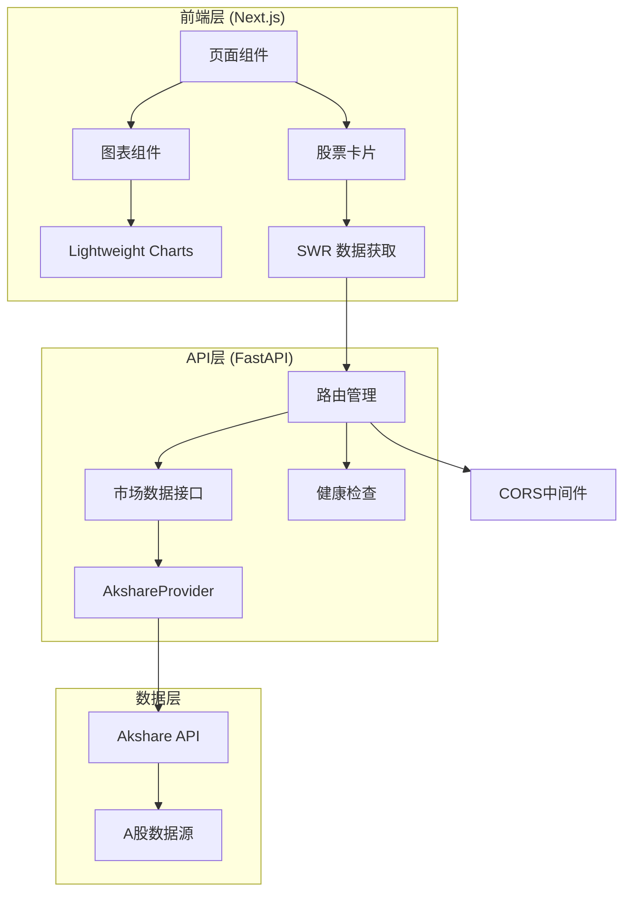

# 系统架构概览

## 项目概述

Five-day-line 是一个基于 A 股数据的金融分析和可视化平台，采用前后端分离架构，提供实时 K 线图表和股票数据分析功能。

## 技术栈

### 后端技术栈
- **框架**: FastAPI (Python 3.13+)
- **数据源**: Akshare (A 股数据提供方)
- **包管理**: uv
- **API文档**: 自动生成 Swagger/OpenAPI
- **开发工具**: pytest, black, mypy, ruff

### 前端技术栈
- **框架**: Next.js 15.1.7 (React 18)
- **UI组件**: Tremor UI
- **图表库**: Lightweight Charts
- **样式**: Tailwind CSS
- **状态管理**: SWR (数据获取)
- **测试**: Playwright

## 系统架构



## 目录结构

```
Five-day-line/
├── src/                          # 后端源码 (PYTHONPATH=src)
│   ├── api/                      # API层
│   │   ├── main.py              # FastAPI应用入口
│   │   └── routers/
│   │       └── market.py        # 市场数据路由
│   ├── trading/                  # 交易数据模块
│   │   ├── data/
│   │   │   ├── models/          # 数据模型
│   │   │   │   ├── bar.py       # K线数据模型
│   │   │   │   └── security.py  # 证券信息模型
│   │   │   └── providers/       # 数据提供方
│   │   │       └── akshare_provider.py
│   │   └── visualization/       # 数据可视化
│   └── app/                      # 应用核心逻辑
├── web/                          # 前端源码
│   ├── app/                      # Next.js页面
│   │   └── page.tsx             # 主页面
│   ├── components/               # React组件
│   │   ├── card/                # 股票卡片组件
│   │   └── chart/               # 图表组件
│   │       └── CandlestickChart.tsx
│   ├── hooks/                    # 自定义Hooks
│   └── lib/                      # 工具库
├── scripts/                      # 开发脚本
│   ├── dev.sh                   # 开发环境启动
│   └── stop.sh                  # 服务停止
└── docs/specs/                   # 规格文档
```

## 核心模块

### 1. API层 (`src/api/`)
- **main.py**: FastAPI应用配置，CORS中间件，路由注册
- **routers/market.py**: 市场数据API端点
  - `GET /api/v1/market/securities`: 获取证券列表
  - `GET /api/v1/market/bars/{symbol}`: 获取K线数据

### 2. 数据模型 (`src/trading/data/models/`)
- **Bar**: K线数据模型 (OHLCV + 时间戳 + 证券代码)
- **Security**: 证券信息模型

### 3. 数据提供方 (`src/trading/data/providers/`)
- **AkshareProvider**: 封装Akshare API，提供统一的A股数据接口

### 4. 前端组件 (`web/components/`)
- **StockCard**: 股票信息卡片，显示单只股票的K线图
- **CandlestickChart**: K线图表组件，基于Lightweight Charts

## 数据流

1. **前端请求**: SWR Hook 发起 HTTP 请求到后端 API
2. **API处理**: FastAPI 路由接收请求，调用 AkshareProvider
3. **数据获取**: AkshareProvider 从 Akshare API 获取 A 股数据
4. **数据转换**: 将原始数据转换为标准化的 Bar/Security 模型
5. **响应返回**: API 返回 JSON 格式的数据给前端
6. **前端渲染**: React 组件接收数据并渲染图表

## 部署架构

### 开发环境
- 后端: `uvicorn` 热重载服务器 (端口 8000)
- 前端: Next.js 开发服务器 (端口 3000)
- 脚本: `scripts/dev.sh` 一键启动

### 生产环境
- 后端: `uvicorn` 生产服务器
- 前端: Next.js 构建后的静态文件 + Node.js 服务器
- 反向代理: 推荐 Nginx 处理静态文件和负载均衡

## 安全考虑

- **CORS配置**: 开发环境允许所有来源，生产环境需限制具体域名
- **数据验证**: FastAPI 自动进行请求参数验证
- **错误处理**: 统一的异常处理和错误响应格式
- **依赖管理**: 使用 uv.lock 确保依赖版本一致性

## 扩展性设计

- **模块化**: 数据提供方接口化，便于添加其他数据源
- **组件化**: 前端组件高度模块化，便于复用和扩展
- **API版本控制**: 使用 `/api/v1/` 前缀，便于版本升级
- **配置管理**: 环境变量和配置文件分离，便于不同环境部署

---

*文档版本: 1.0*  
*最后更新: 2026-02-26*
